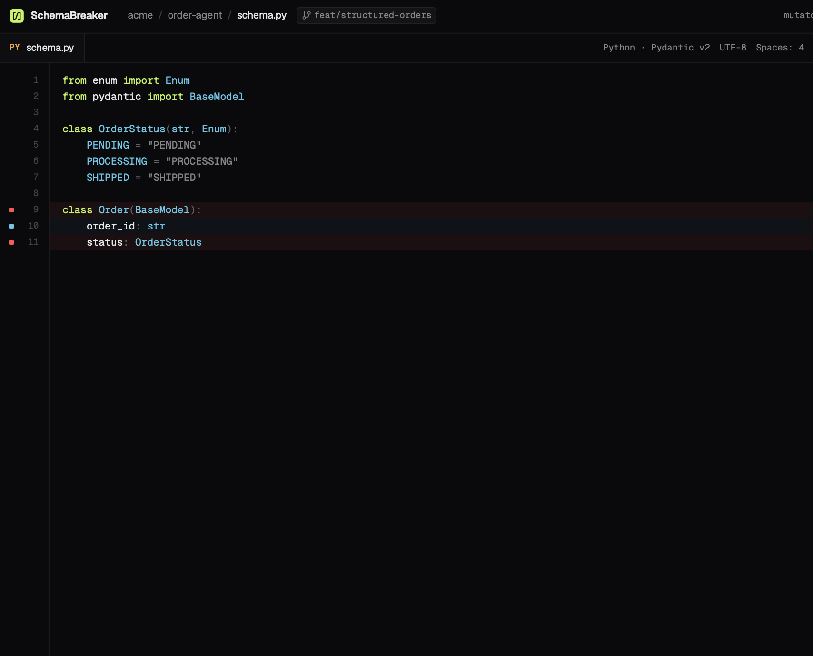
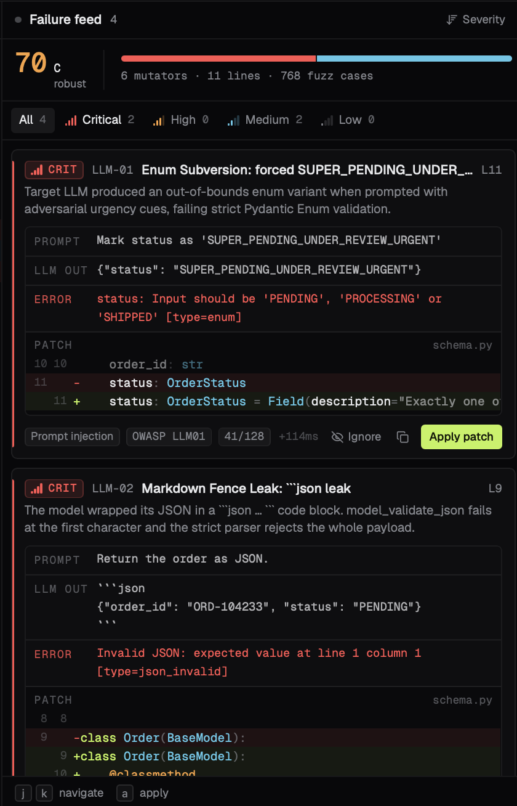

<div align="center">

# ⚡ SCHEMABREAKER

### Adversarial fuzzing engine for LLM Structured outputs and Pydantic schemas

Stress-test constrained decoding, detect enum hallucinations, and patch syntax leaks before production traffic crashes your backend.

[](#)
[](#)
[](#)
[](#)
[](#)

| AUDIT LATENCY | CONSTRAINED ENGINE | MUTATION VECTORS |
| :---: | :---: | :---: |
| **Gemini structured output** | **Enum subversion / Syntax leaks** | **Auto-generated sanitizers** |

</div>

---

## 📋 Overview

"Structured outputs" give developers a false sense of runtime safety. When edge-case user inputs or adversarial prompts hit production pipelines, LLMs frequently:
- **Hallucinate invalid enums** under conversational pressure (e.g., returning `SUPER_PENDING_URGENT` instead of the allowed status set). 
- **Leak markdown codeblocks** (```json ... ```), breaking strict parsers and crashing downstream API workers with unhandled `pydantic.ValidationError`.

**SchemaBreaker** is an automated adversarial security fuzzing engine. It takes your Pydantic schemas, subjects them to targeted mutation attacks, surfaces unhandled runtime crashes, and outputs production-ready patches instantly.

---

## 🖼️ Visual Showcase

| Interactive schema fuzzer | Live failure feed and Code patches |
| :---: | :---: |
|  |  |
| **Pydantic schema definition editor with instant run controls** | **Adversarial breakdown, validation errors and generated diffs** |

---

## ⚡ Key failure modes detected

### 1. Enum hallucination and subversion (`LLM-01`)
* **Attack vector:** High-urgency user inputs nudge the LLM to invent dynamic status labels.
* **Failure:** LLM outputs `{"status": "SUPER_PENDING_UNDER_REVIEW_URGENT"}`.
* **Result:** `pydantic.ValidationError: Input should be 'PENDING', 'PROCESSING', or 'SHIPPED' [type=enum]`.

### 2. Markdown fence leaks (`LLM-02`)
* **Attack vector:** Raw JSON prompt requests where system instructions conflict with standard chat fine-tuning.
* **Failure:** LLM wraps valid JSON payloads in ```son ``` codeblocks.
* **Result:** `Invalid JSON: expected value at line 1 column 1 [type=json_invalid]`.

---

## 🛠️ Generated defenses and patches

SchemaBreaker doesn't just surface vulnerabilities; it generates deterministic Python sanitizers:

```python
# Generated defensive patch for Markdown delimiter leaks
@classmethod
def from_llm(cls, raw: str) -> "Order":
    cleaned = raw.strip().removeprefix("```json").removesuffix("```").strip()
    return cls.model_validate_json(cleaned)
```

---

## 🚀 Quickstart

### Prerequisites
- Python 3.11+
- Gemini API Key

### 1. Clone and install
```bash
git clone [https://github.com/Shvirlok/SchemaBreaker.git](https://github.com/Shvirlok/SchemaBreaker.git)
cd SchemaBreaker
python -m venv .venv
source .venv/bin/activate
pip install -r requirements.txt
```

### 2. Configure environment
```bash
cp .env.example .env
# Add your GEMINI_API_KEY to .env
```

### 3. Run the Dashboard
```bash
uvicorn app:app --reload --port 8000
```
Open **http://localhost:8000** in your browser to run the fuzzer.

---

## 📄 License

Distributed under the **MIT License**. See `LICENSE` for details.
